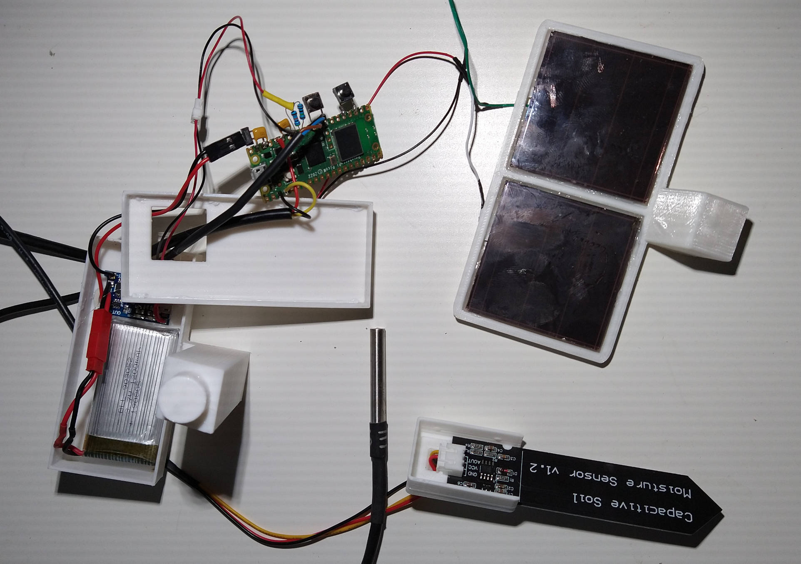
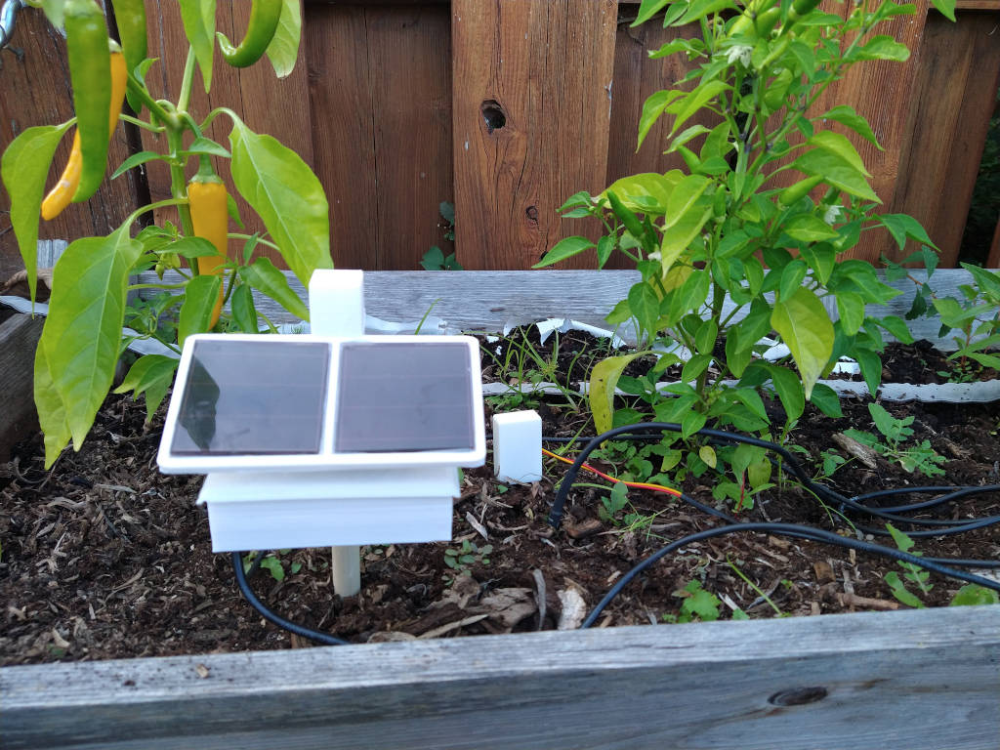
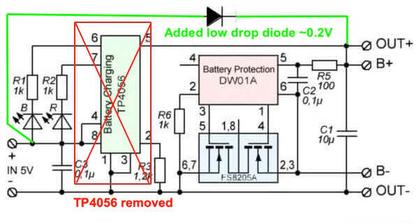
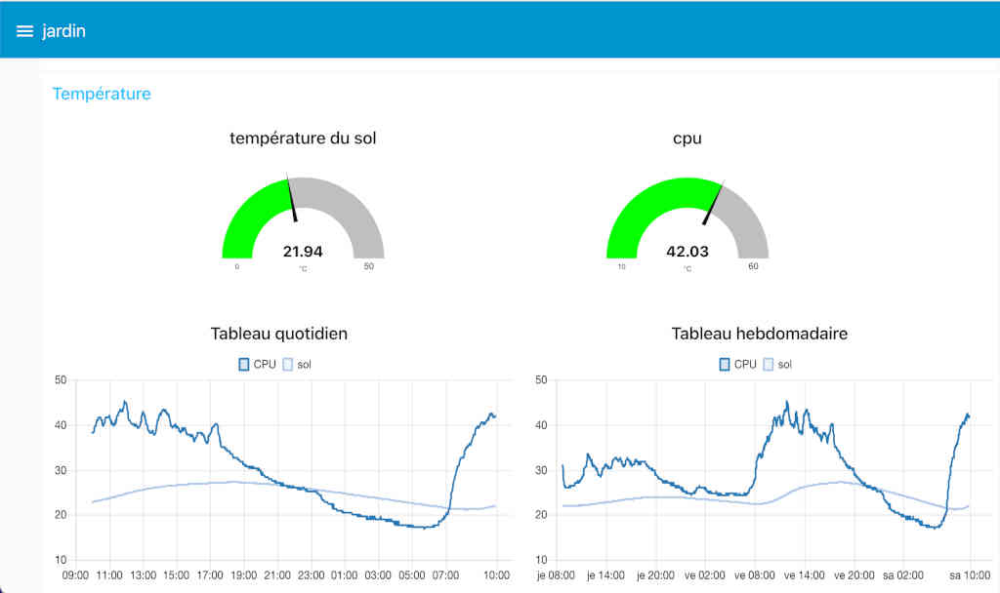
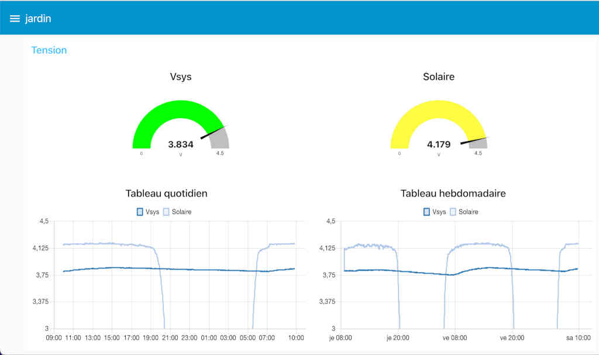

# PicoWSolar

This is a PicoW with a 3.7V lipo battery charged by two old solar cells (2.6V max open and ~25ma short).

I modified the TP4056 charger by replacing the TP4056 I.C. with a low drop diode (~0.2V) on low current.

N.B. you don't need to modiify the TP4056. I did that because my solar cells were not powerfull enough but new ones I bought were good enough.

Data are sent by MQTT to a mosquitto server and after it goes to light sleep. The running cycle depends of the battery Voltage  from 1 to 5 minutes. Right now a minute cycle will discharge the battery even in full sun. This is a good way to be sure that I will never overcharged the battery.

The system publish 5 topics which are,
- Vsys. The Lipo battery Voltage.
- Vsolar. The solar cell voltage.
- tempCPU. The internal temperature of the cpu.
- DS18B20. The ds18B20 temperature. Could multiple sensor on same pin.
- Vmoist. The Voltage of the moist sensor two possible (Vmoist_0 and Vmoist_1).
- bmeT,bmeP,bmeH.  bme280 temperature, pression and humidity.

The bme280 sensor was added. It is necessary to install the library from https://github.com/SebastianRoll/mpy_bme280_esp8266.
The adafruit bme280 i2c address is 0x77.

On the new version it is possible to enable the watchdog. On preliminary test you should disable it. Because of the watchdog the
lightsleep can't be more than 8.3 seconds, this is we have wd_lightsleep() which split the lightsleep in 5 seconds.

Before I do the nodered page I just made simple scripts to check if everything is ok
- On the MQTT broker I ran a script all the times to record all topics from the PicoW with time. 
<quote>mosquitto_sub -h 10.11.12.192 -v -t "PicoW/#" | xargs -d$'\n' -L1 bash -c 'date "+%Y-%m-%d %T.%3N $0"'  >>solar.txt</quote>
- I create a python script that open an excel workbook and transfer the data and automatically open excel with the chart.
- To get the latest 2 days information I just type  "~/getsolar" and the chart displayed.

Description of the file,
- mqtt_ds18B20.py   Main python script store in the pico. You need to change it to main.py when every is working.
- <strike>secrets.py.       Dictionnary which old all info about the wifi and the topics namea. Needs to be store in pico.</strike>
- extractxl.py      Python script to feed data into the excel workbook. (Python script on my computer)
- getsolar          Bash shell to transfer the latest data and display the chart on excel. Small change needs for window .bat file.
- picowsolar.fzz    This is Fritzing schema
- picowsolar_schema.jpg  Schema
- STL folder contains all stl of the 3D case.  Made with tinkercad  <a href="https://www.tinkercad.com/things/b1r0aMqMbmD-picowsolar">picow_solar</a>
- flows.json         NodeRed flow export . Include Voltage, Temperature and moist gauge plus daily and weekly chart.
                    N.B. you need the dashboard module for nodered. 
- flows2.json        NodeRed flow export version with bme sensor. 
&nbsp;&nbsp;&nbsp;   
Before you change the file mqtt_ds18B20.py to main.py  please verify if everything is ok. First disable the watchdog  and change ds18B20 sensors id.
